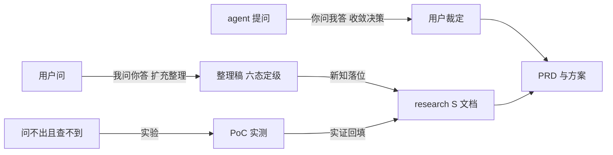

# 双向问答协议：你问我答与我问你答

> 两种对话模式的分工与机制。**你问我答**（agent 拷问用户，收敛决策）用于立项与方案形成；**我问你答**（用户咨询 agent，核验知识）用于理解体系与研究分析。两者都是「知」的通道，问不出也查不到的走行（PoC）。拷问机制吸收自 mattpocock/skills 的 grilling 技能，实验三分与落位义务为本体系扩展 [实证： 2026-09-04 grilling SKILL.md raw 取回]。

## 一、你问我答（拷问模式）

> 何时用：登记立项的追问链执行、方案形成期、用户要压力测试一个想法。产出：用户裁定的决策，落 PRD/方案。

四条机制：

- **设计树**：方案映射成决策树，每个决策分叉出挂在它下面的后续决策
- **前沿轮次**：「前沿」= 前置已定的全部问题。每轮整轮齐问：编号、每问附推荐答案；等用户答复，重算前沿，再问下一轮。依赖本轮未决答案的问题归后轮，不抢跑
- **三分流**：每个前沿问题先归类再处理
  - 事实（查得到）：agent 自己查（文档/rg/sub-agent），禁止问用户任何能查到的东西；探测不阻塞，只有下游问题等它
  - 决策（该拍的）：只有用户能定，问了就等
  - 实验（要实测的）：问不出也查不到，转 PoC/research，标 `[假设]` 附验证路径，不占用户轮次 [推断： grilling 原文只有事实/决策二分，实验类是本体系补的第三类]
- **终止判据**：前沿为空，每个分支都走到，**无一处静默假设**；共识落 PRD/方案，用户确认共识前不动手（反冥行妄作）

## 二、我问你答（咨询模式）

> 何时用：理解体系、查规范、研究分析、评估外来方案。形态：以用户的问为种子，**不断扩充追加所有关联详情**，整理成适合人类理解的整理稿；不以一句话应付 [经验： 用户裁定 2026-09-04]。

整理三步：

- **种子扩散**：从问出发，沿索引与交叉引用把关联详情全部带出（定义、表格、图、联动规则、实例、反例），不止答问句本身
- **人类组织**：输出按人类理解组织（分层小节、表格、对照、图）；仓内文档以机器可读优先（rg/mq），本模式是它的人类渲染面
- **落位回写**：整理中产生的新知按文档义务表转标准形态（research/S 文档等）落仓，整理稿本身不进仓

答前自检三条：

- **先读文档再答**：答案从知识库与信源出，禁止凭记忆重写删减版
- **答必六态**：事实性断言带标记；不能确定的标 `[推断]`/`[假设]` 并给验证路径，禁止猜测冒充结论
- **信源核实**：本地优先（rg/reader）；外部走研究管线（gh/browser-harness）；关键结论双源核对，单源要标注独立性折扣

## 三、闭环：两通道汇于方案

- 模式选择看**答案在哪**：在用户（偏好/取舍/资源）就拷问；在世界（事实/机理）就查证；在实验（跑了才知道）就 PoC
- 两方向都是「知」的通道，汇合处是方案（PRD/PNNNN）；知行合一是两模式共同的底（见 flow-workflow.md 第三节）
